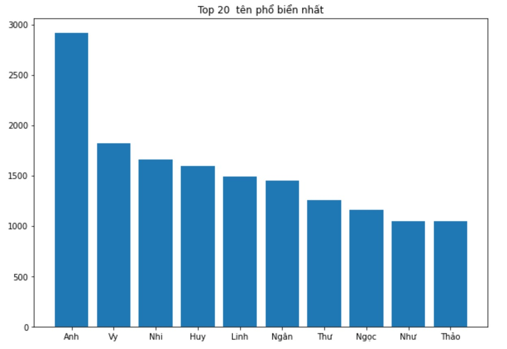

# Graduation_Examination_Analytics

Credit: Dung Lai

You can view his course here: https://dunglailaptrinh.com/L-p-H-c-Data-Science-C-B-n-Python-c735d90b891a4351b658fff8d8cab589

# What I did in this dataset:
1. Used FileIO to read data.txt
2. Used basic techniques to extract clean data
3. Visualized the following insights:
    * Top first names of candidates
    * Top last names of candidates
    * Avarage scores of 11 groups of ages
    * Numbers of candidates who did not sit for some subjects
    * 

  
